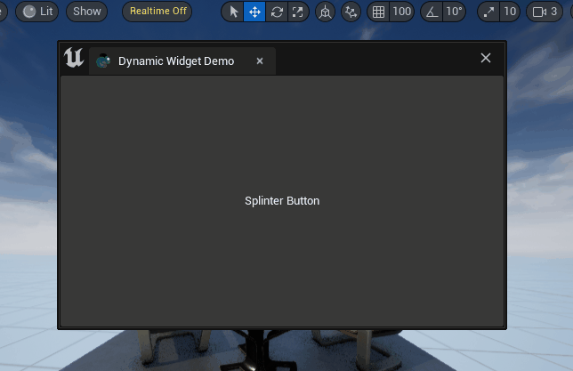

# TAPython_ButtonDivision_Example

A demo project of using TAPython v1.1.0 creating dynamic slate through Python code.

## The Splinter Button



## Prerequisites

The latest TAPython v1.1.0, which can add Slate widget through Python.

Menu Entry in `MenuConfig.json`:

```JSON
    "OnToolBarChameleon": {
        "name": "Python Chameleon on toolbar",
        "items": [
            {
                "name": "Button Division",
                "ChameleonTools": "../Python/ButtonDivision/ButtonDivision.json"
            }
        ]
    }
```

## New API Used

- `chameleon_data_instance.get_all_akas`
- `chameleon_data_instance.get_widget_path_from_aka`
- `chameleon_data_instance.insert_slot_from_json`
- `chameleon_data_instance.remove_widget_at`

## How it works


1. Get the full Slate path of the button widget by its `Aka` name when the button is clicked.
2. Get the Slot index in the parent widget of the button through the path.
3. Create a dictionary containing a `SHorizontalBox` or a `SVerticalBox`, which includes 2-3 buttons, and name them according to the hierarchical relationship and the Slot index where they are located.
4. Convert the dictionary from step 3 into a string form of a JSON object using `json.dumps`.
5. Insert the widget from step 4 into the position where the clicked button is located using `insert_slot_from_json`.
6. Remove the original button using `remove_widget_at`."